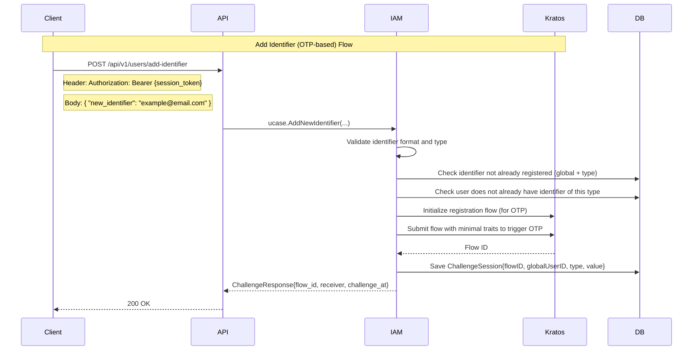

# Add Second Identifier Flow Documentation

This document describes the process by which an authenticated user can add a new login identifier (email or phone) to their account using an OTP-based verification flow. This flow is handled separately from login and registration flows to ensure user identity remains consistent.

---

## Sequence Diagram



---

## API Endpoint

### `POST /api/v1/users/me/add-identifier`

Allows an authenticated user to add an additional identifier (email or phone) to their account. OTP verification is required.

#### Headers

- `X-Tenant-Id`: `string` (required)  
- `Authorization`: `Bearer {session_token}` (required)

#### Request Body

```json
{
  "new_identifier": "string"
}
```

#### Response

```json
{
  "data": {
    "flow_id": "string",
    "receiver": "string",
    "challenge_at": 1721309056
  }
}
```

---

## Flow Logic

| Step | Description |
|------|-------------|
| ✅ 1 | Validate identifier format (email or phone) |
| ✅ 2 | Ensure identifier is **not already registered** within tenant |
| ✅ 3 | Ensure user doesn't already have another identifier of the same type |
| ✅ 4 | Initialize Kratos registration flow |
| ✅ 5 | Submit minimal `traits` to Kratos (email or phone only) to trigger OTP |
| ✅ 6 | Save challenge session to database |
| ✅ 7 | Return flow info to client for verification |

---

## Error Responses

All responses follow the standard error format:

```json
{
  "status": 400,
  "code": "MSG_INVALID_TENANT",
  "message": "Invalid tenant",
  "errors": [
    {
      "field": "new_identifier",
      "error": "Identifier already exists"
    }
  ]
}
```

### Common Error Codes

| Code | Description |
|------|-------------|
| `MSG_INVALID_TENANT` | Invalid or missing tenant ID |
| `MSG_UNAUTHORIZED` | Missing or invalid session token |
| `MSG_INVALID_PAYLOAD` | Invalid request body |
| `MSG_INVALID_IDENTIFIER_TYPE` | Identifier must be email or phone |
| `MSG_INVALID_EMAIL` | Email format is invalid |
| `MSG_INVALID_PHONE_NUMBER` | Phone number is invalid |
| `MSG_IDENTIFIER_ALREADY_EXISTS` | Identifier already exists in system |
| `MSG_IDENTIFIER_TYPE_EXISTS` | User already has a primary identifier of this type |
| `MSG_RATE_LIMIT_EXCEEDED` | Too many OTP attempts |
| `MSG_INIT_REG_FLOW_FAILED` | Failed to initialize Kratos registration flow |
| `MSG_REGISTRATION_FAILED` | Kratos failed to submit registration flow |
| `MSG_SAVE_CHALLENGE_FAILED` | Could not persist challenge session to DB |

---

## Security Considerations

| Area | Control |
|------|---------|
| **Authentication** | Requires valid session token |
| **Tenant Isolation** | Identifier must be unique per tenant, not global |
| **Delegation** | Not applicable (user modifies own identity) |
| **OTP Delivery** | Via Kratos registration flow (email or SMS) |
| **Replay Protection** | Challenge session is one-time and time-limited |
| **Rate Limiting** | OTP requests are limited to prevent abuse |

---

## Best Practices

### System Design

- Enforce one identifier per type (e.g., only one email per user)
- Keep identifier verification isolated from login/registration
- Don't allow adding identifier already bound to other users
- Store `ChallengeType` in session for verification distinction

### User Experience

- Show clear OTP prompt after calling this API
- Support “resend code” with rate limits
- Mask existing identifiers to show what’s already linked

### Logging & Monitoring

- Log challenge creation & resolution events
- Track identifiers added per user for audit
- Alert on excessive OTP attempts (possible abuse)

---

## Example Request

```http
POST /api/v1/users/me/add-identifier
Authorization: Bearer ory_abc.def.ghi
X-Tenant-Id: tenant-123

{
  "new_identifier": "alice@example.com"
}
```

**Response:**

```json
{
  "data": {
    "flow_id": "bc47e918-9f41-46d7-85f2-46d14a7d56a9",
    "receiver": "alice@example.com",
    "challenge_at": 1721309056
  }
}
```

---

> ✅ Continue verification via `POST /api/v1/users/challenge-verify` with the returned `flow_id` and OTP `code` to complete the identifier linking. `type` must be "register" when verifying a new identifier.
