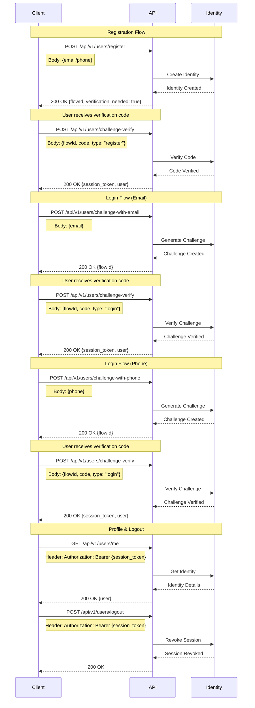

# Authentication Flows Documentation

The following sequence diagram illustrates the main authentication flows in the system:



## API Endpoints

### Registration
- `POST /api/v1/users/register`
  - Headers:
    - `X-Tenant-Id`: string (required)
  - Request Body:
    ```json
    {
      "email": "string",  // Either email or phone must be provided
      "phone": "string"   // Cannot provide both
    }
    ```
  - Response:
    ```json
    {
      "data": {
        "verification_flow": {
          "flow_id": "string",
          "receiver": "string",
          "challenge_at": number
        },
        "verification_needed": true
      }
    }
    ```

### Login
- `POST /api/v1/users/challenge-with-email`
  - Headers:
    - `X-Tenant-Id`: string (required)
  - Request Body:
    ```json
    {
      "email": "string"
    }
    ```
  - Response:
    ```json
    {
      "data": {
        "flow_id": "string",
        "receiver": "string",
        "challenge_at": number
      }
    }
    ```

- `POST /api/v1/users/challenge-with-phone`
  - Headers:
    - `X-Tenant-Id`: string (required)
  - Request Body:
    ```json
    {
      "phone": "string"
    }
    ```
  - Response:
    ```json
    {
      "data": {
        "flow_id": "string",
        "receiver": "string",
        "challenge_at": number
      }
    }
    ```

### Verification
- `POST /api/v1/users/challenge-verify`
  - Headers:
    - `X-Tenant-Id`: string (required)
  - Request Body:
    ```json
    {
      "flow_id": "string",
      "code": "string",
      "type": "register" | "login"
    }
    ```
  - Response:
    ```json
    {
      "data": {
        "session_id": "string",
        "session_token": "string",
        "issued_at": "string",
        "expires_at": "string",
        "authenticated_at": "string",
        "authentication_methods": ["string"],
        "active": boolean,
        "user": {
          "id": "string",
          "email": "string",
          "phone": "string",
          "name": "string",
          "first_name": "string",
          "last_name": "string",
          "full_name": "string",
          "user_name": "string",
          "tenant": "string",
          "status": boolean,
          "created_at": number,
          "updated_at": number
        }
      }
    }
    ```

### Profile
- `GET /api/v1/users/me`
  - Headers:
    - `X-Tenant-Id`: string (required)
    - `Authorization`: Bearer {session_token} (required)
  - Response:
    ```json
    {
      "data": {
        "id": "string",
        "email": "string",
        "phone": "string",
        "name": "string",
        "first_name": "string",
        "last_name": "string",
        "full_name": "string",
        "user_name": "string",
        "tenant": "string",
        "status": boolean,
        "created_at": number,
        "updated_at": number
      }
    }
    ```

### Logout
- `POST /api/v1/users/logout`
  - Headers:
    - `X-Tenant-Id`: string (required)
    - `Authorization`: Bearer {session_token} (required)
  - Request Body: empty object `{}`
  - Response: 200 OK

## Error Responses

All endpoints may return the following error responses:

```json
{
  "status": number,    // HTTP status code
  "code": "string",    // Error code
  "message": "string", // Human-readable error message
  "errors": [         // Optional array of detailed errors
    {
      "field": "string",
      "error": "string"
    }
  ]
}
```

Common error codes:
- `MSG_INVALID_TENANT` - Invalid or missing tenant ID
- `MSG_INVALID_PAYLOAD` - Invalid request payload
- `MSG_INVALID_PHONE_NUMBER` - Phone number must be in international format (e.g., +1234567890)
- `MSG_UNAUTHORIZED` - Invalid or missing session token
- `MSG_CONTACT_METHOD_REQUIRED` - Either email or phone must be provided
- `MSG_ONLY_EMAIL_OR_PHONE_MUST_BE_PROVIDED` - Cannot provide both email and phone
- `MSG_EMAIL_IS_REQUIRED` - Email is required for email challenge
- `MSG_PHONE_NUMBER_IS_REQUIRED` - Phone number is required for phone challenge
- `MSG_FAILED_TO_MAKE_CHALLENGE` - Failed to create challenge
- `MSG_INVALID_VERIFICATION_TYPE` - Invalid verification type
- `MSG_FAILED_TO_GET_USER_PROFILE` - Failed to get user profile
- `MSG_IAM_LOOKUP_FAILED` - Failed to query IAM database for identity check
- `MSG_EMAIL_ALREADY_EXISTS` - Email has already been registered
- `MSG_PHONE_ALREADY_EXISTS` - Phone number has already been registered
- `MSG_RATE_LIMIT_CHECK_FAILED` - Could not check rate limit
- `MSG_RATE_LIMIT_EXCEEDED` - Too many attempts, please try again later
