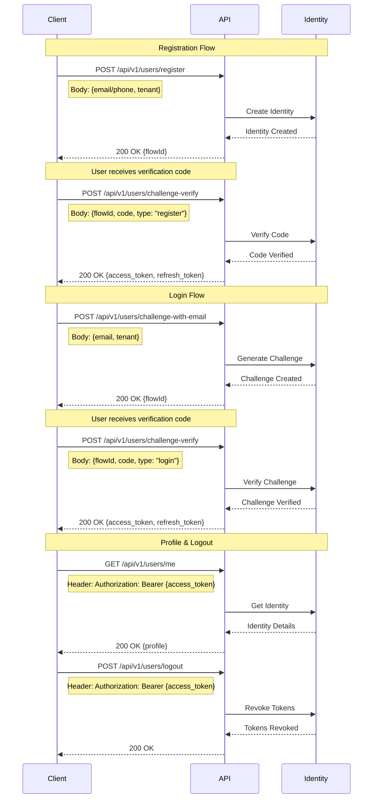

# Authentication Flows Documentation

The following sequence diagram illustrates the main authentication flows in the system:



## API Endpoints

### Registration
- `POST /api/v1/users/register`
  - Request: `{ email/phone: string, tenant: string }`
  - Response: `{ flowId: string }`

### Login
- `POST /api/v1/users/challenge-with-email`
  - Request: `{ email: string, tenant: string }`
  - Response: `{ flowId: string }`
- `POST /api/v1/users/challenge-with-phone`
  - Request: `{ phone: string, tenant: string }`
  - Response: `{ flowId: string }`

### Verification
- `POST /api/v1/users/challenge-verify`
  - Request: `{ flowId: string, code: string, type: "register" | "login" }`
  - Response: `{ access_token: string, refresh_token: string }`

### Profile
- `GET /api/v1/users/me`
  - Header: `Authorization: Bearer {access_token}`
  - Response: `{ profile: object }`

### Logout
- `POST /api/v1/users/logout`
  - Header: `Authorization: Bearer {access_token}`
  - Response: `200 OK`

## Error Responses

Common error responses across all endpoints:

- `400 Bad Request` - Invalid request format or missing required fields
- `401 Unauthorized` - Invalid or expired access token
- `404 Not Found` - Resource not found
- `429 Too Many Requests` - Rate limit exceeded
- `500 Internal Server Error` - Server error

### Example Error Response
```json
{
  "error": "invalid_request",
  "message": "Missing required field: tenant",
  "code": 400
}
```