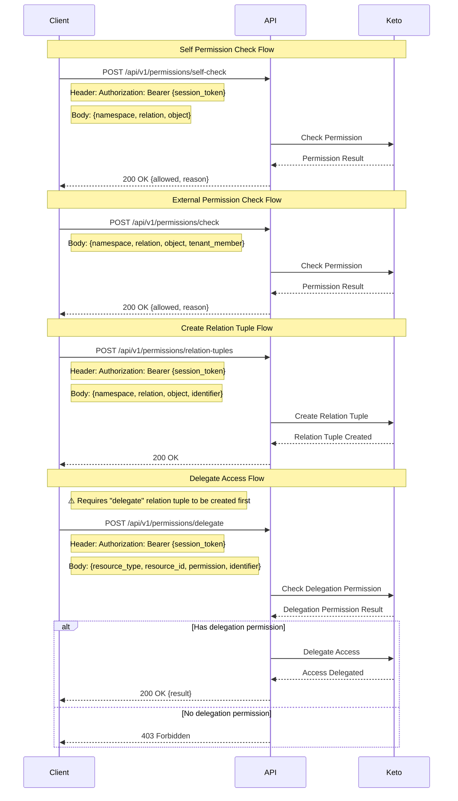

# Authorization Flows Documentation

The following sequence diagram illustrates the main authorization flows in the system:



## API Endpoints

### Self Permission Check

- `POST /api/v1/permissions/self-check`
  - Headers:
    - `X-Tenant-Id`: string (required)
    - `Authorization`: Bearer {session_token} (required)
  - Request Body:

    ```jsonc
    {
      "namespace": "string",  // Name of the resource's group (e.g., "document", "user")
      "relation": "string",   // The relation between the subject and the object (e.g., "read", "write", "delete")
      "object": "string"      // The specific resource (e.g., "document:123")
    }
    ```

  - Response:

    ```jsonc
    {
      "data": {
        "allowed": "boolean",
        "reason": "string"  // Optional explanation for why permission was denied
      }
    }
    ```

### External Permission Check

- `POST /api/v1/permissions/check`
  - Headers:
    - `X-Tenant-Id`: string (required)
  - Request Body:

    ```jsonc
    {
      "namespace": "string",  // Name of the resource's group (e.g., "document", "user")
      "relation": "string",   // The relation between the subject and the object (e.g., "read", "write", "delete")
      "object": "string",     // The specific resource (e.g., "document:123")
      "tenant_member": {
        "tenant_id": "string",
        "identifier": "string"  // Email or phone number of the tenant member
      }
    }
    ```

  - Response:

    ```jsonc
    {
      "data": {
        "allowed": "boolean",
        "reason": "string"  // Optional explanation for why permission was denied
      }
    }
    ```

### Create Relation Tuple
> Currently, this endpoint is open for any user to call,
> This should restricted access to only admin or authorized service, with tenant-scoped access
- `POST /api/v1/permissions/relation-tuples`
  - Headers:
    - `X-Tenant-Id`: string (required)
    - `Authorization`: Bearer {session_token} (required)
  - Request Body:

    ```jsonc
    {
      "namespace": "string",   // Name of the resource's group (e.g., "document", "user")
      "relation": "string",    // The relation to create (e.g., "read", "write", "delete")
      "object": "string",      // The specific resource (e.g., "document:123")
      "identifier": "string"   // Email or phone number of the user to grant permission to
    }
    ```

  - Response:

    ```jsonc
    {
      "data": {
        "message": "Relation tuple created successfully"
      }
    }
    ```

### Delegate Access
> ⚠️ **Important**: Before calling this endpoint, you must first create a `delegate` relation tuple via `/api/v1/permissions/relation-tuples`.  
> This tuple grants the caller the right to delegate the specified permission on the target resource.  
> Without it, the API will respond with `403 Forbidden`.
**Example Relation Tuple to Allow Delegation:**

```jsonc
{
  "namespace": "document",
  "relation": "delegate",
  "object": "document:123",
  "identifier": "alice@example.com"
}
```

- `POST /api/v1/permissions/delegate`
  - Headers:
    - `X-Tenant-Id`: string (required)
    - `Authorization`: Bearer {session_token} (required)
  - Request Body:

    ```jsonc
    {
      "resource_type": "string",  // Type of resource (e.g., "document", "user")
      "resource_id": "string",    // ID of the specific resource
      "permission": "string",     // Permission to delegate (e.g., "read", "write")
      "identifier": "string"      // Email or phone number of the user to delegate to
    }
    ```

  - Response:

    ```jsonc
    {
      "data": {
        "result": "boolean"  // Whether the delegation was successful
      }
    }
    ```

## Permission Model

The authorization system uses a relationship-based permission model with the following components:

### Namespace
A logical grouping of resources (e.g., "document", "user", "project"). Namespaces help organize permissions and prevent conflicts between different resource types.

### Relation
The type of relationship or action that can be performed (e.g., "read", "write", "delete", "manage", "delegate"). Relations define what actions are possible on resources.

### Object
The specific resource being accessed, typically in the format `{resource_type}:{resource_id}` (e.g., "document:123", "user:456").

### Subject
The entity requesting access, identified by their email or phone number within a tenant context.

## Common Permission Patterns

### Document Access Control
```jsonc
{
  "namespace": "document",
  "relation": "read",
  "object": "document:123"
}
```

### User Management
```jsonc
{
  "namespace": "user",
  "relation": "manage",
  "object": "user:456"
}
```

### Project Collaboration
```jsonc
{
  "namespace": "project",
  "relation": "write",
  "object": "project:789"
}
```

## Error Responses

All endpoints may return the following error responses:

```jsonc
{
  "status": number,    // HTTP status code
  "code": "string",    // Error code
  "message": "string", // Human-readable error message
  "errors": [         // Optional array of detailed errors
    {
      "field": "string",
      "error": "string"
    }
  ]
}
```

Common error codes:

- `MSG_INVALID_TENANT` - Invalid or missing tenant ID
- `MSG_INVALID_PAYLOAD` - Invalid request payload
- `MSG_UNAUTHORIZED` - Invalid or missing session token
- `MSG_GET_USER_PROFILE_FAILED` - Failed to get user profile from session
- `MSG_PERMISSION_CHECK_FAILED` - Failed to check permission
- `MSG_CREATE_RELATION_TUPLE_FAILED` - Failed to create relation tuple
- `MSG_CHECK_DELEGATION_PERMISSION_FAILED` - Failed to check delegation permission
- `MSG_DELEGATION_NOT_ALLOWED` - User doesn't have permission to delegate access
- `MSG_DELEGATE_ACCESS_FAILED` - Failed to delegate access

## Security Considerations

### Session-Based Authorization
- All user-facing endpoints require a valid session token
- Session tokens are validated on each request
- User identity is extracted from the session for permission checks

### Tenant Isolation
- All permission operations are scoped to a specific tenant
- Cross-tenant access is not allowed by default
- Tenant ID must be provided in the `X-Tenant-Id` header

### Delegation Security
- Users can only delegate permissions they themselves possess
- Delegation requires explicit "delegate" permission on the resource
- Delegated permissions can be revoked by removing relation tuples

### Rate Limiting
- Permission check endpoints may be rate-limited to prevent abuse
- Relation tuple creation is limited to prevent permission sprawl

## Best Practices

### Permission Design
1. Use descriptive namespaces to group related resources
2. Define clear, specific relations that match business requirements
3. Use consistent object naming patterns (e.g., `{type}:{id}`)
4. Implement least-privilege access by default

### Relation Tuple Management
1. Create relation tuples only when necessary
2. Regularly audit and clean up unused permissions
3. Use bulk operations for managing multiple permissions
4. Document permission schemas for each namespace

### Error Handling
1. Always check permission before performing sensitive operations
2. Provide meaningful error messages for permission denials
3. Log permission check failures for security monitoring
4. Implement graceful degradation when permission service is unavailable 