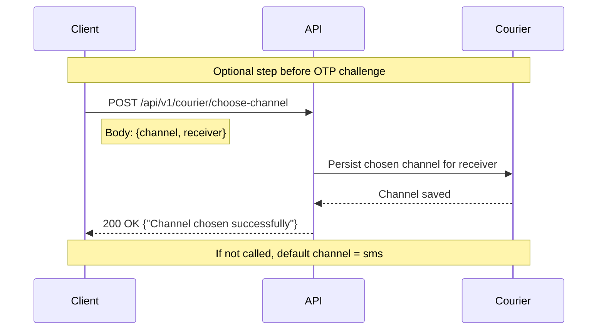

# Choose Delivery Channel

This document describes how a client can explicitly choose the OTP delivery channel for a receiver. If no channel is chosen, the default delivery channel is `sms`.

## Sequence Diagram



## Endpoint

- `POST /api/v1/courier/choose-channel`
  - Headers:
    - `X-Tenant-Id`: string (required)
  - Request Body:

    ```json
    {
      "channel": "sms | whatsapp | zalo",
      "receiver": "+1234567890"
    }
    ```

  - Response:

    ```json
    {
      "data": "Channel chosen successfully"
    }
    ```

  - Notes:
    - If this endpoint is not called, the default delivery channel for OTP is `sms`.
    - `receiver` must be a valid phone number in E.164 format.
    - `channel` must be one of: `sms`, `whatsapp`, `zalo`.

## Error Responses

The endpoint may return the following errors:

- `MSG_INVALID_TENANT` - Invalid or missing tenant ID
- `MSG_INVALID_PAYLOAD` - Invalid request payload
- `MSG_INVALID_FIELDS` - Missing `channel` or `receiver`
