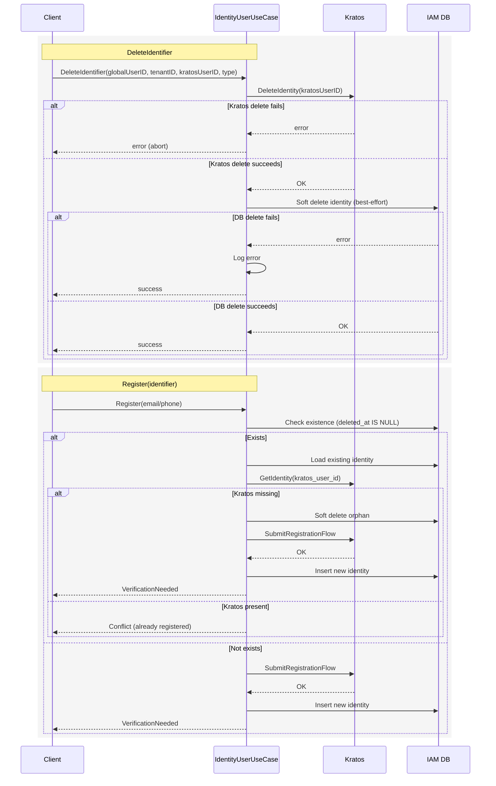

### DeleteIdentifier and Register flows (soft delete + orphan cleanup)



# Delete Identifier Flow Documentation

---

## Sequence Diagram


---

This document describes how an authenticated user deletes an identifier (email or phone). Deletion is only allowed if the user has more than one identifier. If a user recently updated or added a new identifier, they must complete verification via `challenge-verify` first; deletion does not bypass verification.

---

## API Endpoints

### `DELETE /api/v1/users/me/delete-identifier`

Allows an authenticated user to delete an identifier (email or phone) from their account. Cannot delete the only identifier (must retain at least one of email or phone).

#### Headers

- `X-Tenant-Id`: `string` (required)
- `Authorization`: `Bearer {session_token}` (required)

#### Request Body

```json
{
  "identifier_type": "email|phone_number" // The identifier type to delete
}
```

#### Response

```json
{
  "data": {
    "message": "Identifier deleted successfully"
  }
}
```

---

---

## Error Responses

All responses follow the standard error format:

```json
{
  "status": number,
  "code": "string",
  "message": "string"
}
```

### Common Error Codes

| Code | Description |
|------|-------------|
| `MSG_INVALID_TENANT` | Invalid or missing tenant ID |
| `MSG_UNAUTHORIZED` | Missing or invalid session token |
| `MSG_INVALID_PAYLOAD` | Invalid request body |
| `MSG_INVALID_IDENTIFIER_TYPE` | Identifier must be `email` or `phone_number` |
| `MSG_IDENTIFIER_TYPE_NOT_EXISTS` | User does not have an identifier of this type |
| `MSG_CANNOT_DELETE_ONLY_IDENTIFIER` | Cannot delete the only identifier |
| `MSG_GET_IDENTIFIERS_FAILED` | Failed to get user identifiers |
| `MSG_DELETE_IDENTIFIER_FAILED` | Failed to delete identifier |

---

## Example Request

```http
DELETE /api/v1/users/me/delete-identifier
Authorization: Bearer ory_abc.def.ghi
X-Tenant-Id: tenant-123

{
  "identifier_type": "email"
}
```

**Response:**

```json
{
  "status": 200,
  "code": "MSG_SUCCESS",
  "message": "Success",
  "data": {
    "message": "Identifier deleted successfully"
  }
}
```

---

> **Important**: You cannot delete your only identifier. At least one email or phone must remain on your account.
