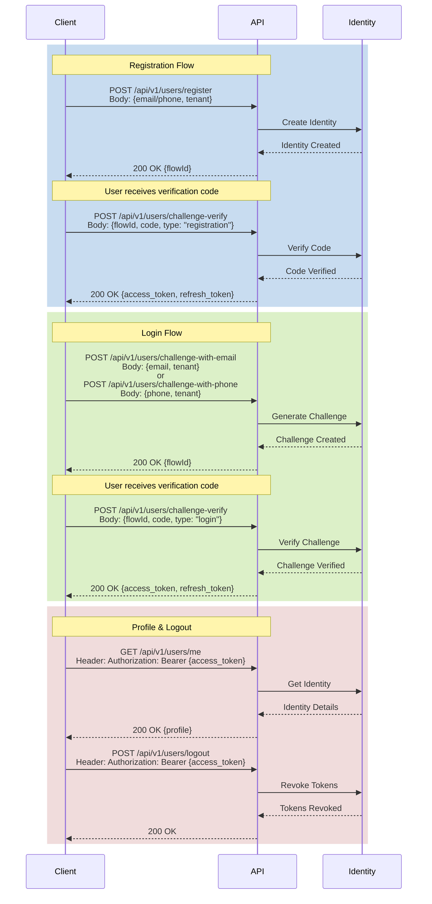

### Authentication Flows Documentation

The following sequence diagram illustrates the main authentication flows in the system:

### API Endpoints

#### Registration
- `POST /api/v1/users/register`
  - Request: `{ email/phone: string, tenant: string }`
  - Response: `{ flowId: string }`

#### Login
- `POST /api/v1/users/challenge-with-email`
  - Request: `{ email: string, tenant: string }`
  - Response: `{ flowId: string }`
- `POST /api/v1/users/challenge-with-phone`
  - Request: `{ phone: string, tenant: string }`
  - Response: `{ flowId: string }`

#### Verification
- `POST /api/v1/users/challenge-verify`
  - Request: `{ flowId: string, code: string, type: "registration" | "login" }`
  - Response: `{ access_token: string, refresh_token: string }`

#### Profile
- `GET /api/v1/users/me`
  - Header: `Authorization: Bearer {access_token}`
  - Response: `{ profile: object }`

#### Logout
- `POST /api/v1/users/logout`
  - Header: `Authorization: Bearer {access_token}`
  - Response: `200 OK`

