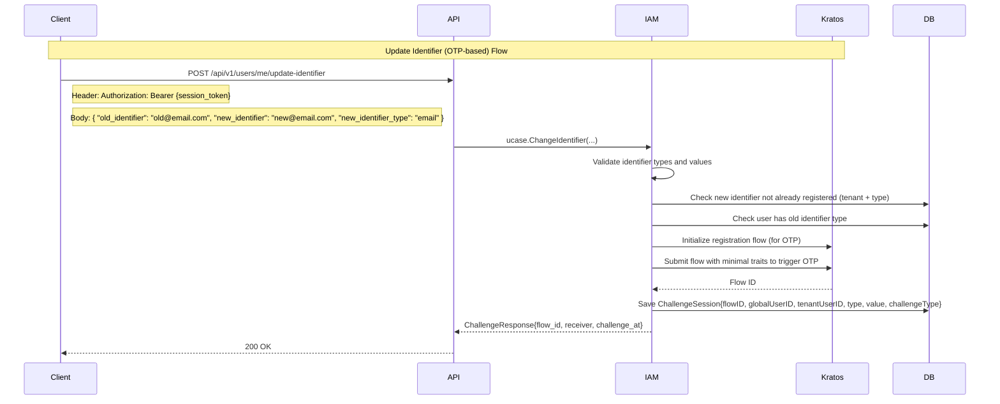

# Update Identifier Flow Documentation

This document describes the process by which an authenticated user can update their primary login identifier (email or phone) using an OTP-based verification flow. This flow replaces the existing identifier with a new one, ensuring only one identifier of each type per user.

---

## Sequence Diagram



---

## API Endpoint

### `POST /api/v1/users/me/update-identifier`

Allows an authenticated user to update their primary identifier (email or phone) to a new value. OTP verification is required.

#### Headers

- `X-Tenant-Id`: `string` (required)
- `Authorization`: `Bearer {session_token}` (required)

#### Request Body

```json
{
  "old_identifier": "string", // The current identifier value (email or phone)
  "new_identifier": "string", // The new identifier value
  "new_identifier_type": "email|phone" // The type of the new identifier
}
```

#### Response

```json
{
  "status": 200,
  "code": "MSG_SUCCESS",
  "message": "Success",
  "data": {
    "flow_id": "string",
    "receiver": "string",
    "challenge_at": 1721309056
  }
}
```

---

## Flow Logic

| Step | Description |
|------|-------------|
| 1 | Validate identifier types and values (email or phone) |
| 2 | Ensure new identifier is **not already registered** within tenant |
| 3 | Ensure user has an existing identifier of the type to update |
| 4 | If user has more than one identifier, only allow replacing the same type (email→email, phone→phone) |
| 5 | Initialize Kratos registration flow |
| 6 | Submit minimal `traits` to Kratos (email or phone only) to trigger OTP |
| 7 | Save challenge session to database |
| 8 | Return flow info to client for verification |

---

## Error Responses

All responses follow the standard error format:

```json
{
  "status": 400,
  "code": "MSG_INVALID_TENANT",
  "message": "Invalid tenant",
  "errors": [
    {
      "field": "new_identifier",
      "error": "Identifier already exists"
    }
  ]
}
```

### Common Error Codes

| Code | Description |
|------|-------------|
| `MSG_INVALID_TENANT` | Invalid or missing tenant ID |
| `MSG_UNAUTHORIZED` | Missing or invalid session token |
| `MSG_INVALID_PAYLOAD` | Invalid request body |
| `MSG_INVALID_IDENTIFIER_TYPE` | Identifier must be email or phone |
| `MSG_INVALID_EMAIL` | Email format is invalid |
| `MSG_INVALID_PHONE_NUMBER` | Phone number is invalid |
| `MSG_IDENTIFIER_ALREADY_EXISTS` | Identifier already exists in system |
| `MSG_IDENTIFIER_TYPE_NOT_EXISTS` | User does not have an identifier of this type to update |
| `MSG_MULTIPLE_IDENTIFIERS_EXISTS` | User has multiple identifiers, cross-type change not allowed |
| `MSG_RATE_LIMIT_EXCEEDED` | Too many OTP attempts |
| `MSG_INIT_REG_FLOW_FAILED` | Failed to initialize Kratos registration flow |
| `MSG_REGISTRATION_FAILED` | Kratos failed to submit registration flow |
| `MSG_SAVE_CHALLENGE_FAILED` | Could not persist challenge session to DB |

---

## Security Considerations

| Area | Control |
|------|---------|
| **Authentication** | Requires valid session token |
| **Tenant Isolation** | Identifier must be unique per tenant, not global |
| **Delegation** | Not applicable (user modifies own identity) |
| **OTP Delivery** | Via Kratos registration flow (email or SMS) |
| **Replay Protection** | Challenge session is one-time and time-limited |
| **Rate Limiting** | OTP requests are limited to prevent abuse |
| **Identifier Replacement** | Old identifier is properly deactivated after update |

---

## Best Practices

### System Design
- Enforce one identifier per type (e.g., only one email per user)
- Keep identifier verification isolated from login/registration
- Don't allow updating to identifier already bound to other users
- Store `ChallengeType` in session for verification distinction
- Properly deactivate old identifier after successful update

### User Experience
- Show clear OTP prompt after calling this API
- Support "resend code" with rate limits
- Display current identifier being updated
- Provide clear confirmation after successful update

### Logging & Monitoring
- Log challenge creation & resolution events
- Track identifier updates per user for audit
- Alert on excessive OTP attempts (possible abuse)
- Monitor identifier replacement success rates

---

## Example Request

```http
POST /api/v1/users/me/update-identifier
Authorization: Bearer ory_abc.def.ghi
X-Tenant-Id: tenant-123

{
  "old_identifier": "oldemail@example.com",
  "new_identifier": "newemail@example.com",
  "new_identifier_type": "email"
}
```

**Response:**

```json
{
  "status": 200,
  "code": "MSG_SUCCESS",
  "message": "Success",
  "data": {
    "flow_id": "bc47e918-9f41-46d7-85f2-46d14a7d56a9",
    "receiver": "newemail@example.com",
    "challenge_at": 1721309056
  }
}
```

---

## Verification Flow

After receiving the flow information, the client must:

1. **Get OTP**: Retrieve the OTP code sent to the new identifier
2. **Verify OTP**: Call the verification endpoint with the OTP code
3. **Complete Update**: The system will replace the old identifier with the new one

### Verification Request

```http
POST /api/v1/users/challenge-verify
X-Tenant-Id: tenant-123

{
  "flow_id": "bc47e918-9f41-46d7-85f2-46d14a7d56a9",
  "code": "123456",
  "type": "register"
}
```

### Verification Response

```json
{
  "status": 200,
  "code": "MSG_SUCCESS",
  "message": "Success",
  "data": {
    "session_id": "new-session-id",
    "session_token": "new-session-token",
    "active": true,
    "expires_at": "2025-01-27T08:40:17.488897884Z",
    "issued_at": "2025-01-27T08:25:17.488897884Z",
    "authenticated_at": "2025-01-27T08:25:17.488897884Z",
    "user": {
      "id": "new-user-id",
      "phone": "+84321339334"
    },
    "authentication_methods": ["code"]
  }
}
```

---

## Post-Update Behavior

After successful identifier update:

1. **Old Identifier Deactivated**: The old identifier can no longer be used for login
2. **New Identifier Active**: The new identifier becomes the primary login method
3. **Session Refresh**: User receives a new session token
4. **Profile Updated**: User profile reflects the new identifier

### Verification of Update

To verify the update was successful:

```http
GET /api/v1/users/me
Authorization: Bearer new-session-token
X-Tenant-Id: tenant-123
```

**Response:**

```json
{
  "status": 200,
  "code": "MSG_SUCCESS",
  "message": "Success",
  "data": {
    "global_user_id": "user-global-id",
    "id": "new-user-id",
    "phone": "+84321339334",
    "tenant": "tenant-name"
  }
}
```

---

> **Important**: After successful update, the old identifier will be deactivated and cannot be used for login. Users must use the new identifier for all future authentication attempts. 