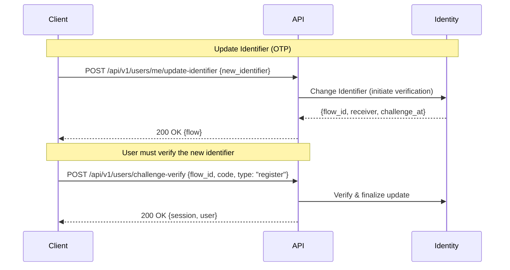

# Update Identifier Flow Documentation

This document describes how an authenticated user updates their primary login identifier (email or phone) using an OTP-based verification flow.

---

## Sequence Diagram



---

## API Endpoints

### `POST /api/v1/users/me/update-identifier`

Allows an authenticated user to update their primary identifier. The new identifier's type (email or phone) is inferred from the provided value. OTP verification is required.

#### Headers

- `X-Tenant-Id`: `string` (required)
- `Authorization`: `Bearer {session_token}` (required)

#### Request Body

```json
{
  "new_identifier": "string" // The new identifier value (email or phone). Type is inferred.
}
```

#### Response

```json
{
  "data": {
    "flow_id": "string",
    "receiver": "string",
    "challenge_at": number
  }
}
```

---

### Verification

- `POST /api/v1/users/challenge-verify`
  - Headers:
    - `X-Tenant-Id`: string (required)
  - Request Body:

    ```json
    {
      "flow_id": "string",
      "code": "string",
      "type": "register"
    }
    ```

  - Response:

    ```json
    {
      "data": {
        "session_id": "string",
        "session_token": "string",
        "issued_at": "string",
        "expires_at": "string",
        "authenticated_at": "string",
        "authentication_methods": ["string"],
        "active": boolean,
        "user": {
          "id": "string",
          "email": "string",
          "phone": "string"
        }
      }
    }
    ```

---

## Error Responses

All responses follow the standard error format:

```json
{
  "status": number,
  "code": "string",
  "message": "string",
  "errors": [
    {
      "field": "string",
      "error": "string"
    }
  ]
}
```

### Common Error Codes

| Code | Description |
|------|-------------|
| `MSG_INVALID_TENANT` | Invalid or missing tenant ID |
| `MSG_UNAUTHORIZED` | Missing or invalid session token |
| `MSG_INVALID_PAYLOAD` | Invalid request body |
| `MSG_INVALID_IDENTIFIER_TYPE` | Identifier must be valid email or E.164 phone |
| `MSG_INVALID_EMAIL` | Email format is invalid |
| `MSG_INVALID_PHONE_NUMBER` | Phone number is invalid |
| `MSG_IDENTIFIER_ALREADY_EXISTS` | Identifier already exists in tenant |
| `MSG_NO_IDENTIFIER_EXISTS` | User has no identifier to update |
| `MSG_MULTIPLE_IDENTIFIERS_EXISTS` | User has multiple identifiers; cross-type change not allowed |
| `MSG_RATE_LIMIT_EXCEEDED` | Too many OTP attempts |
| `MSG_INIT_REG_FLOW_FAILED` | Failed to initialize verification flow |
| `MSG_REGISTRATION_FAILED` | Verification submission failed |
| `MSG_SAVE_CHALLENGE_FAILED` | Could not persist challenge session |

---

## Behavior

- Type inference: The system detects whether `new_identifier` is an email or phone. Emails are lowercased; phone numbers are normalized to E.164.
- Single identifier present (email OR phone): cross-type switching is allowed (email→phone, phone→email).
- Multiple identifiers present (email AND phone): only same-type replacement is allowed (email→email or phone→phone).

Examples:

- Only phone on account, update to email:
  - Input: `{ "new_identifier": "new@example.com" }`
  - Result: Starts OTP flow to update phone→email.
- Only email on account, update to phone:
  - Input: `{ "new_identifier": "+15551234567" }`
  - Result: Starts OTP flow to update email→phone.
- Both email and phone on account, update email:
  - Input: `{ "new_identifier": "new@example.com" }`
  - Result: Starts OTP flow to replace email with new email. Cross-type changes are rejected with `MSG_MULTIPLE_IDENTIFIERS_EXISTS`.
---