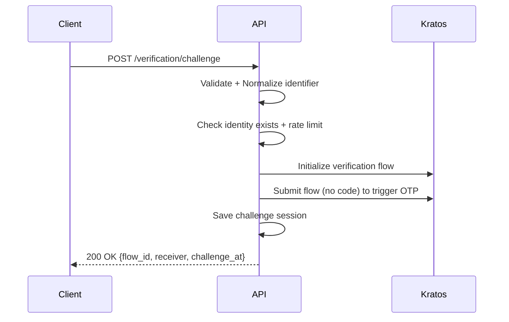
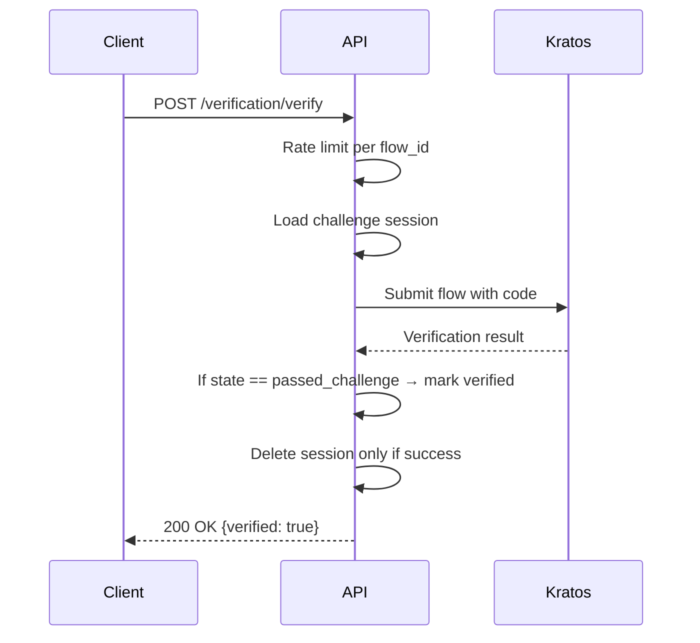

# Identifier Verification Flow

This document describes the verification flow for email/phone identifiers in the IAM system, using Ory Kratos.

## 1. Challenge Verification (Send OTP)

### Endpoint

```
POST /api/v1/users/verification/challenge
```

### Purpose

Trigger a verification flow for a given identifier (email or phone number) by sending an OTP.

### Request Headers

- `X-Tenant-Id`: string (required)
- `Authorization`: Bearer token (required)

### Request Body

```json
{
  "identifier": "user@example.com"
}
```

### Response

```json
{
  "flow_id": "string",
  "receiver": "string",
  "challenge_at": 1694089999
}
```

### Flow Logic



---

## 2. Verify Identifier (Submit OTP)

### Endpoint

```
POST /api/v1/users/challenge-verify
```

### Purpose

Submit the OTP received via email/SMS to complete verification.

### Request Headers

- `X-Tenant-Id`: string (required)
- `Authorization`: Bearer token (required)

### Request Body

```json
{
  "flow_id": "string",
  "code": "123456",
  "type": "verify"
}
```

### Response

```json
{
  "flow_id": "string",
  "identifier": "user@example.com",
  "identifier_type": "email",
  "verified": true,
  "verified_at": 1694090099
}
```

### Flow Logic



---

## DTOs

### `IdentityVerificationChallengeDTO`

```json
{
  "identifier": "string"
}
```

### `IdentityChallengeVerifyDTO`

```json
{
  "flow_id": "string",
  "code": "string",
  "type": "register" | "login" | "verify"
}
```

---

## Error Cases

| HTTP | Code                        | Message                        |
|------|-----------------------------|--------------------------------|
| 400  | MSG_INVALID_IDENTIFIER_TYPE | Invalid identifier type        |
| 400  | MSG_INVALID_EMAIL           | Invalid email                  |
| 400  | MSG_INVALID_PHONE           | Invalid phone number           |
| 404  | MSG_IDENTITY_NOT_FOUND      | Identifier not found           |
| 429  | MSG_RATE_LIMIT_EXCEEDED     | Rate limit exceeded            |
| 500  | MSG_SEND_VERIFICATION_FAILED| Failed to send verification    |
| 500  | MSG_VERIFICATION_FAILED     | Verification failed            |
| 500  | MSG_SAVING_SESSION_FAILED   | Could not store challenge state|

---

## Notes

- Kratos verification flows are used — no OTP logic is implemented locally.
- Identifiers must already exist for `type=verify` to be valid.
- Rate limiting is enforced both for challenge and verification.
- If the code is invalid or expired, the session is not deleted - the user can retry until the flow expires.
- Challenge session is cleaned up after successful verification.
